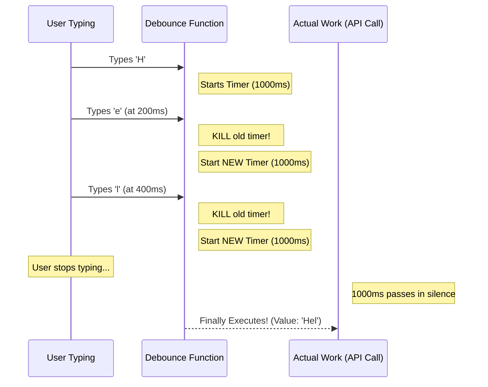

# JavaScript Debouncing Basics

This project explains **Debouncing**—a performance optimization technique that limits how often a function can fire.

## 1. What is Debouncing?

Debouncing is a programming pattern used to improve browser performance. It acts as a "gatekeeper" that prevents a function from being called too many times in a short period.

Instead of running a function every time an event fires (like every single keystroke), debouncing forces the function to wait until there is a **pause** in the activity.

---

## 2. The Elevator Analogy 🛗

Imagine you are standing in an elevator. The doors are about to close, but then someone else walks in and presses the "Open" button.

1.  **The elevator waits** for 5 seconds before closing.
2.  **Reset:** If a new person enters at the 4th second, the elevator **restarts** its 5-second countdown.
3.  **Execute:** The elevator only actually moves when 5 full seconds have passed without anyone pressing the button.

**That is Debouncing.** It waits for a "period of silence" before doing the work.

---

## 3. The 3 Golden Rules of Debouncing

1.  **Delay the Action:** Never run the function the instant the event happens.
2.  **Clear the Past:** If the event happens again, "kill" the previous timer immediately.
3.  **Wait for Silence:** Only execute the function when the user has stopped for the specified duration (e.g., 500ms or 1000ms).

---

## 4. How it Works (Logic Flow)

---

## 5. Why do we need this?

Without debouncing, every single keystroke in a search bar could trigger a database request. If a user types "JavaScript" (10 letters), you would send **10 API requests**!

With debouncing, you only send **1 API request** after they finish typing the whole word. This saves:
- **Server Costs** (Less traffic)
- **Performance** (Faster UI)
- **Battery Life** (Less processing)

---

## 6. How to test it out:

1. Open `index.html` in your browser.
2. Open your Developer Tools (**Right Click -> Inspect**).
3. Navigate to the **Console** tab.
4. Type quickly in the input box and watch the logs. You'll see the "Timer Reset" message many times, but the "Function Executed" message only once!

---

## 7. Beginner-Friendly Resources for Debouncing

Want to master performance optimization and timing functions? Start here:

1. **[Debouncing and Throttling Explained Through Visualizations](https://css-tricks.com/debouncing-throttling-explained-examples/)** _(Article)_
   The best visual guide to understanding the difference between debouncing and throttling with interactive demos.

2. **[The Modern JavaScript Tutorial: Scheduling](https://javascript.info/settimeout-setinterval)** _(Article)_
   A deep dive into `setTimeout` and `clearTimeout`, the core building blocks of the debounce pattern.

3. **[FreeCodeCamp: How to Implement Debounce from Scratch](https://www.freecodecamp.org/news/javascript-debounce-example/)** _(Guide)_
   A step-by-step walkthrough of the logic we used in this project, explained for absolute beginners.
